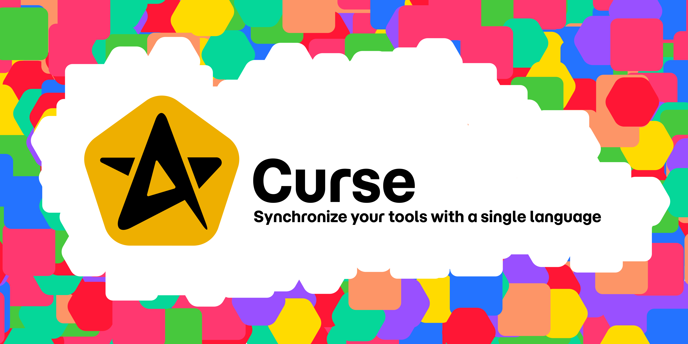

> 🚧 **Coming Soon**  
> This repository is a preview of **Curse**, a CLI to sync your tools with Git.  
> The first public release is on its way — contributions and feedback are welcome in the meantime!

# Curse
Curse is a CLI framework that connects your tools to Git using a unified metadata format.

It works as a bundle of connectors for tools like Figma, Workday, Jira, Penpot…, enabling two-way synchronization of metadata:

## What is Curse?
Curse is a bundle of connectors that bridges your operational tools and Git.

It enables bidirectional metadata sync:

- Export flow
Connects to tools like Figma, Jira, Workday, Penpot…

Extracts metadata (design tokens, org charts, issues…)

Transforms it into .gen.{json,yaml,md} files

Pushes it to Git — versioned, traceable, and shareable

- Import flow
Reads .gen.{json,yaml,md} files from Git

Converts them back into native metadata

Updates your tools with Git-sourced data

Curse makes Git your universal metadata language.

# Use cases
Centralize design tokens from Figma

Sync Jira epics with Git-based planning

Version org charts from Workday

Automate documentation from Penpot components